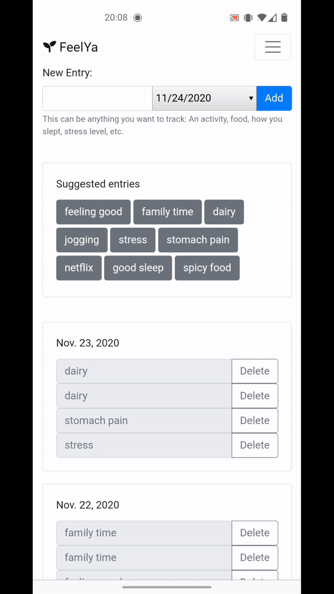
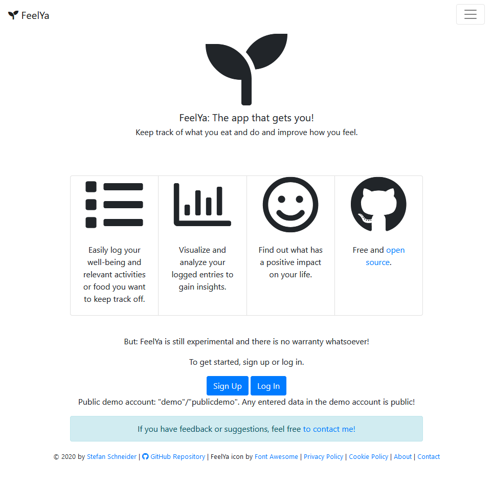
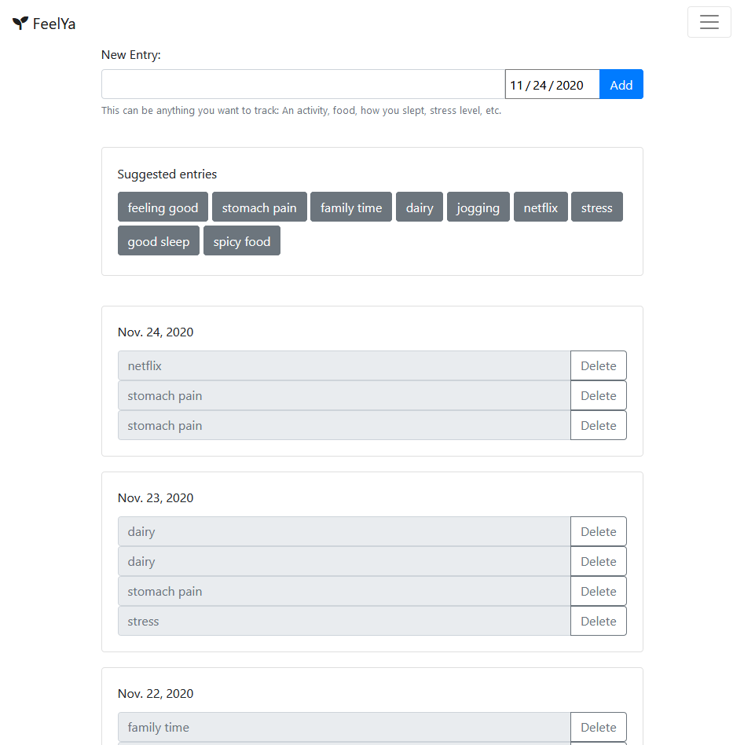
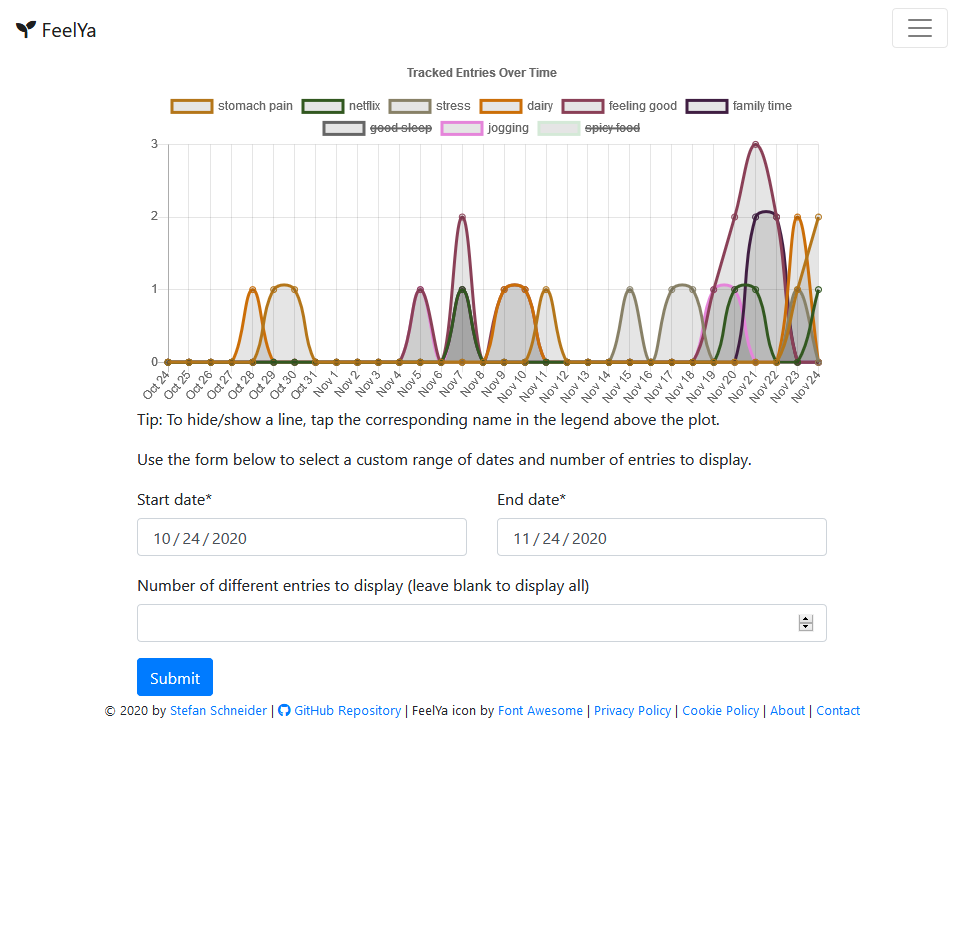

**Status:** Prototype finished. Bug fixes or minor new features may still be added. Contributions or feedback are welcome.

**Live demo:** [Heroku](https://feelya-app.herokuapp.com/), **Video walkthrough:** [YouTube](https://youtu.be/ONDT1Y4QbcM)

# FeelYa

✔️😊 FeelYa: The app that gets you! Keep track of what you eat and do and improve how you feel. 

FeelYa is a simple progressive web app (PWA) that helps you keep track of what you do and understand what makes you feel good.

* Simply keep track of whatever is relevant to you: Food, sport, work, other activities - and how you feel.
* Add the same entry multiple times to indicate a larger quantity, e.g., more food/sport/stress/...
* Visualize your most common entries within a custom time frame
* Analyze your entires over time to identify what has a positive impact and what has a negative impact
* Use anywhere: Responsive design and secured via password



Technology stack:

* Backend: Python 3.8 and Django 3
* Frontend: Bootstrap 4 and Chart.js
* Database: PostgreSQL by Heroku (SQLite locally)
* Other: Deployment on Heroku, CI/CD through GitHub, Google Analytics

## Usage

Go to [Heroku](https://feelya-app.herokuapp.com/), to test FeelYa directly or build and host it yourself (see below).



After [creating an account](https://feelya-app.herokuapp.com/accounts/register/), you can start adding entries simply by entering whatever you want to track in the textbox on top.
For example, you could track food you eat ("spicy food", "kiwi", "dairy", "gluten") or other things ("stress", "work", "workout", "relaxing").
Make sure to also track how you feel, e.g., ("happy", "stressed", "tired", "itchy skin", ...).
To indicate different quantities or strengths, simply add the entry again.
You can also change the date at the top, to track entries for another day.
You can also tap common entries in the quick add bar to add them directly without any typing.



Finally, look at your logged entries over time, to find out if there are any interdependencies.
Select a time frame and entries you're interested in to get a better overview.
You can select the time frame below the chart and the shown entries by clicking them in the legend of the chart.



## Hosting FeelYa Yourself

### Install

You need Python 3.8

```
python setup.py install
```

### Deployment

#### Local

```
python manage.py runserver
# go to http://127.0.0.1:8000
```

### Production Deployment on Heroku

Deployment is automatically updated with new pushes to `main`.

Set the following config vars in Heroku (= env vars):

* `DJANGO_SETTINGS_MODULE`: `project.prod_settings`
* `DJANGO_SECRET_KEY`: `<randomly-generated-secret-key>`
* `DATABASE_URL`: URL to Heroku Postgres DB
* `SENDGRID_API_KEY`: `<sendgrid-api-key>`
* `CONTACT_MAIL`: `<email-address-for-receiving-contact-messages>`

For serving static files (e.g., favicon) in production, FeelYa uses `whitenoise`.
For deployment, also `Procfile` and `runtime.txt` are relevant.

## Todos

* Fix `django-pwa`: "Add to homescreen" popup doesn't show as it should.
* Add page that shows the correlation between logged entries: 
    * Select an entry of interest (e.g., "feeling good") and it should show highly correlated values.
    * For that, also consider time-shifted impact, e.g., after a few days
* Configurable sets of entries: E.g., create custom set "lunch", which contains multiple entries at once
* Push notifications with daily reminders to track
